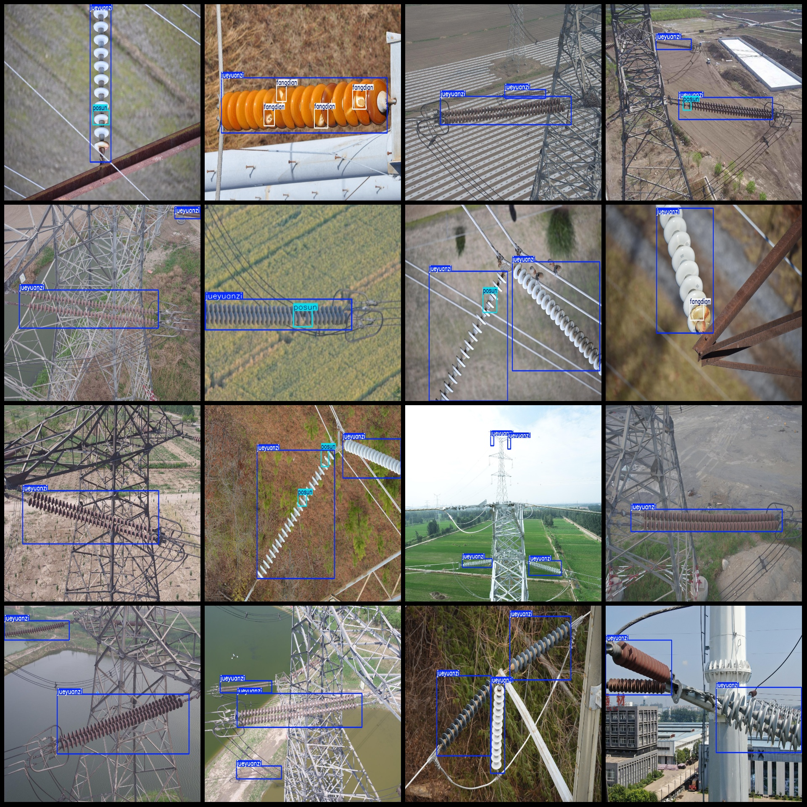
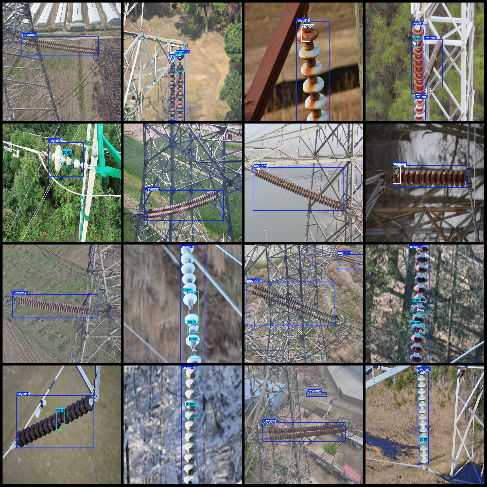

# Power Scene Insulator Defect Detection Dataset VOC+YOLO Format, 4086 Images in 3 Categories

The dataset format: Pascal VOC format + YOLO format (without the split path's txt file, only containing jpg images and their corresponding VOC format xml files and yolo format txt files).

Number of images (jpg file count): 4086
Number of annotations (xml file count): 4086
Number of annotations (txt file count): 4086
Number of annotation categories: 3
Annotation category name (note that the order of labels in the yolo format is not consistent with this, but is based on the "labels" folder's "classes.txt"): ["fangdian", "jueyuanzi", "posun"]
Each category has a specified number of bounding boxes:
- Fangdian (Discharge) has 1144 bounding boxes
- Jueyuanzi (Insulator) has 7514 bounding boxes
- Posun (Broken) has 1780 bounding boxes
Total bounding boxes: 10438
Each category occupies a certain number of images:
- Fangdian occupies 673 images
- Jueyuanzi occupies 4085 images
- Posun occupies 1526 images
Image resolution: Multi-resolution images, such as 1280x854, 1152x864, etc.
Used labeling tool: labelImg
Labeling rules: Draw rectangular bounding boxes for each category
Important Notice: The dataset does not have divided training, validation, or test sets; you need to divide them yourself.
Special Notice: This dataset does not guarantee any accuracy of the trained models or weight files.
Image Preview:
Annotation Example:

## Images

Here is a pay link on Stripe ( https://buy.stripe.com/3cs8yP7sY87d0vu9AB ). Please contact me lonlonago@foxmail.com after funding $89, and I will send you a complete data files , thank you!

